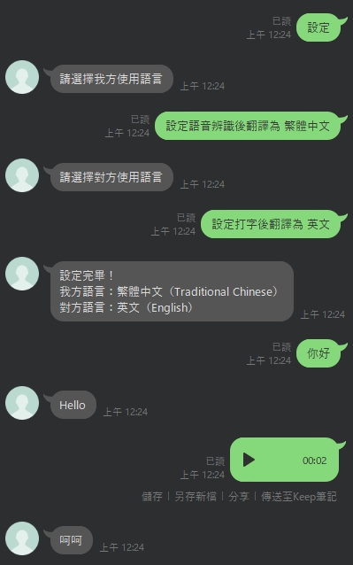

# gpt-ai-translator

使用 Flask、OpenAI API 來開發語言翻譯 Line 機器人。  
This project is a language translation chatbot for Line, built with Flask and integrated with the OpenAI API.

## 使用案例



#### 使用指令

| 指令     | 別名             | 說明         |
| -------- | ---------------- | ------------ |
| 目前設定 | /current-setting | 查詢目前設定 |
| 設定     | /setting         | 設定語言     |

**備註：建議在手持裝置操作這些指令，因為輸入"設定"會一步步帶各位完成語言設定哦。**

#### 支援語系

| 語系     | 英文描述            |
| -------- | ------------------- |
| 繁體中文 | Traditional Chinese |
| 簡體中文 | Simplified Chinese  |
| 英文     | English             |
| 日文     | Japanese            |
| 韓文     | Korean              |
| 越南文   | Vietnamese          |
| 泰文     | Thai                |
| 印尼文   | Indonesian          |
| 義大利文 | Italian             |
| 西班牙文 | Spanish             |
| 葡萄牙文 | Portuguese          |
| 德文     | German              |
| 法文     | French              |

## 如何開始

#### 環境變數

| 名稱                                   | 預設值            | 說明                                                                   |
| -------------------------------------- | ----------------- | ---------------------------------------------------------------------- |
| APP_ENVIRONMENT                        | VERCEL            | 執行環境                                                               |
| APP_NAME                               | gpt-ai-translator | 應用名稱                                                               |
| APP_PERSISTENT_USER_SETTINGS_ENABLED   | false             | 是否持久化使用者設定（功能須依賴 Upstash Redis）                       |
| APP_PUSH_TRANSLATED_TEXT_AUDIO_ENABLED | false             | 是否對翻譯結果多推送一則語音訊息（功能須依賴 Minio）                   |
| LINE_CHANNEL_ACCESS_TOKEN              | null              | LINE 的 [Channel Access Token](data/img/line-channel-access-token.png) |
| LINE_CHANNEL_SECRET                    | null              | LINE 的 [Channel Secret](data/img/line-channel-secret.png)             |
| OPENAI_API_KEY                         | null              | OpenAI 的 [API Key](data/img/openai-api-key.png)                       |
| OPENAI_COMPLETION_MODEL                | gpt-5-nano        | OpenAI 的交談[模型](https://platform.openai.com/docs/models)           |
| OPENAI_COMPLETION_TEMPERATURE          | 1.0               | OpenAI 的交談模型溫度                                                  |
| OPENAI_TTS_MODEL                       | gpt-4o-mini-tts   | OpenAI 的文字轉語音[模型](https://platform.openai.com/docs/models)     |
| OPENAI_TTS_VOICE                       | alloy             | OpenAI 的文字轉語音聲音                                                |
| OPENAI_WHISPER_MODEL                   | whisper-1         | OpenAI 的語音轉文字[模型](https://platform.openai.com/docs/models)     |
| LRU_CACHE_SIZE                         | 100               | 本地快取大小                                                           |
| UPSTASH_REDIS_REST_URL                 | null              | Upstash Redis 的 [API Url](data/img/upstash-redis-rest-info.png)       |
| UPSTASH_REDIS_REST_TOKEN               | null              | Upstash Redis 的 [API Token](data/img/upstash-redis-rest-info.png)     |
| MINIO_ENDPOINT                         | null              | Minio 的 Endpoint                                                      |
| MINIO_ACCESS_KEY                       | null              | Minio 的 [Access Key](data/img/minio-key.png)                          |
| MINIO_SECRET_KEY                       | null              | Minio 的 [Secret Key](data/img/minio-key.png)                          |
| MINIO_BUCKET                           | null              | Minio 的 Bucket 名稱                                                   |

#### 部署至 Vercel

[](https://vercel.com/new/clone?repository-url=https%3A%2F%2Fgithub.com%2Fcdcd72%2Fgpt-ai-translator&env=LINE_CHANNEL_ACCESS_TOKEN,LINE_CHANNEL_SECRET,OPENAI_API_KEY)

## 如何偵錯

#### 調整 api/index.py 部分程式碼以可以在本機測試

```python
# from api.ai.chatgpt import ChatGPT
# from api.bot.line import Line
# from api.config.key import ConfigKey
# from api.config.language import lang_dict, reverse_lang_dict
# from api.config.loader import ConfigLoader
# from api.media.tinytag import TinyTagMedia
# from api.storage.cache import CacheConfig, MultiTierCacheAdapter
# from api.storage.minio import MinioStorage
# from api.utils.audio_processor import AudioProcessor
# from api.utils.user_settings_manager import UserSettingsManager
from ai.chatgpt import ChatGPT
from bot.line import Line
from config.key import ConfigKey
from config.language import lang_dict, reverse_lang_dict
from config.loader import ConfigLoader
from media.tinytag import TinyTagMedia
from storage.cache import CacheConfig, MultiTierCacheAdapter
from storage.minio import MinioStorage
from utils.audio_processor import AudioProcessor
from utils.user_settings_manager import UserSettingsManager
```

#### 依據 .env.example 格式並在根目錄新增 .env

    APP_ENVIRONMENT=DEVELOPMENT
    LINE_CHANNEL_ACCESS_TOKEN=your_line_channel_access_token
    LINE_CHANNEL_SECRET=your_line_channel_secret
    OPENAI_API_KEY=your_openai_api_key

#### 安裝相依套件

    pip install -r requirements.txt

#### 執行 Flask

    py api/index.py

## 參考

- Line SDK : [https://github.com/line/line-bot-sdk-python](https://github.com/line/line-bot-sdk-python)
- OpenAI API Document : [https://platform.openai.com/docs/introduction](https://platform.openai.com/docs/introduction)
